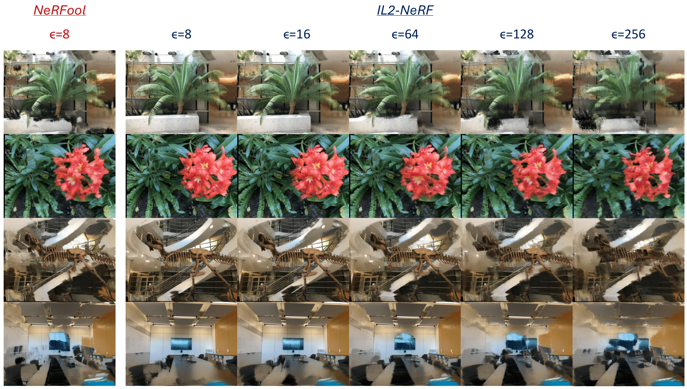

# Advancing Adversarial Robustness in GNeRFs: The IL2-NeRF Attack
This repository contains the code for the IL2-NeRF attack (Published at CVPR 2025).


## Abstract
Generalizable Neural Radiance Fields (GNeRF) are recognized as one of the most promising techniques for novel view synthesis and 3D model generation in real-world applications. However, like other generative models in computer vision, ensuring their adversarial robustness against various threat models is essential for practical use. The pioneering work in this area, NeRFool, introduced a state-of-the-art attack that targets GNeRFs by manipulating source views before feature extraction, successfully disrupting the color and density results of the constructed views. Building on this foundation, we propose IL2-NeRF (Iterative $L_2$ NeRF Attack), a novel adversarial attack method that explores a new threat model (in the $L_2$ domain) for attacking GNeRFs.  We evaluated IL2-NeRF against two standard GNeRF models across three benchmark datasets, demonstrating similar performance compared to NeRFool, based on the same evaluation metrics proposed by NeRFool. Our results establish IL2-NeRF as the first adversarial method for GNeRFs under the $L_2$ norm. We establish a foundational $L_2$ threat model for future research, enabling direct performance comparisons while introducing a smoother, image-wide perturbation approach in Adversarial 3D Reconstruction.


### Prerequisites

* **Install the conda environment**:

``` 
conda env create -f env.yml
```
* **Prepare the evaluation data**: The evaluation datasets, including LLFF, NeRF Synthetic, and DeepVoxels, are organized in the following structure:

```
├──data/
    ├──nerf_llff_data/
    ├──nerf_synthetic/
    ├──deepvoxels/
```

They can be downloaded by running the following command under the `data/` directory:

```
bash download_eval_data.sh
```
Thanks to GitHub User wuyou012 (Zongqi He) for providing the new Google Drive links.

* **Prepare the pretrained model**: To evaluate the adversarial robustness of pretrained GNeRFs, you can download the official [IBRNet](https://github.com/googleinterns/IBRNet) model from [here](https://drive.google.com/uc?id=165Et85R8YnL-5NcehG0fzqsnAUN8uxUJ).


* **Update the paths** to datasets & pretrained models in the configuration files: `configs/eval_*`.


### Attacking GNeRFs using NeRFool and IL2-NERF

- Attack using **view-specific NeRFool** on the LLFF dataset:

```
CUDA_VISIBLE_DEVICES=0 python eval_adv.py --config ../configs/eval_llff.txt --expname test --num_source_views 4 --adv_iters 1000 --adv_lr 1 --epsilon 8 --use_adam --adam_lr 1e-3 --lr_gamma=1 --view_specific
```

- Attack using **IL2-NeRF** on the LLFF dataset:

```
CUDA_VISIBLE_DEVICES=0 python eval_adv_L2.py --config ../configs/eval_llff.txt --expname test --num_source_views 4 --adv_iters 1000 --adv_lr 1 --epsilon 8 --adam_lr 1e-3 --lr_gamma=1 --view_specific
```

### Results 



Visual comparing predicted images on four LLFF scenes from IBRNet on NeRFool and IL2-NeRF perturbed images on varying perturbation factors $\epsilon$.

## Citation 

```
@article{meng2025il2nerf,
    title={Advancing Adversarial Robustness in GNeRFs: The IL2-NeRF Attack},
    author={Nicole Meng and Caleb Manicke and Ronak Sahu and Caiwen Ding and Yingjie Lao},
    journal={IEEE/CVF Conference on Computer Vision and Pattern Recognition},
    year={2025}
}
```

## Acknowledgement

This codebase is modified on top of [[NeRFool]](https://github.com/GATECH-EIC/NeRFool).
Codebase for [[IBRNet]](https://github.com/googleinterns/IBRNet) and [[GNT]](https://github.com/VITA-Group/GNT) are also used here.


